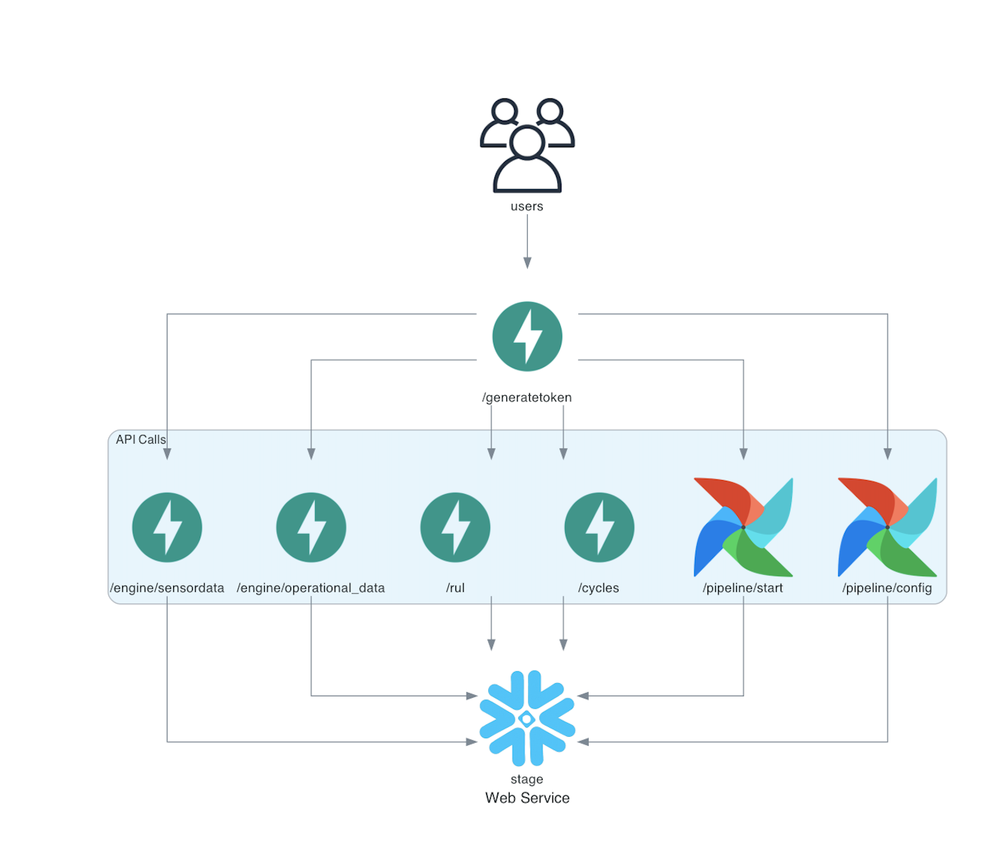

## Data As a Service
In this Assignment we have reviewed the Moody's Analytics portal to understand how APIs are designed and made the Nasa Turbofan Jet Engine Data available as an API

## Pipeline


### Requirements - 
Install the dependencies as outlines in the requirements.txt by running 
`pip install -r requirements.txt`

### Folder Structure - 
```
Assignment3/
├── APIDiagram.ipynb - Diagram that represents the design of the API
├── cmaps_data/ - All the data in the form of text files
│   ├── readme.txt
│   ├── RUL_FD001.txt
│   ├── RUL_FD002.txt
│   ├── RUL_FD003.txt
│   ├── RUL_FD004.txt
│   ├── test_FD001.txt
│   ├── test_FD002.txt
│   ├── test_FD003.txt
│   ├── test_FD004.txt
│   ├── train_FD001.txt
│   ├── train_FD002.txt
│   ├── train_FD003.txt
│   ├── train_FD004.txt
├── confest.py - Python file to initialize the test client of the API
├── dags/
│   └── cmaps_pipeline.py - Python file with all the code related to pipeline execution
├── final_data/
│   ├── rul.csv - Final Processed file which contains data realted to RUL table
│   └── train_test.csv - Final Processed file which contains data realted to TRAIN_TEST table
├── images/
│   ├── moodyPipeline.png - Diagram that represents design of a moody's API
│   └── pipeline.png - Diagram of the actual Airflow pipeline
├── locustfile.py - Python code to execute locust load testing on the API
├── main.py - Python file that contains API code
├── query.py - Python code to query a Snowflake Table
├── README.md - Contains complete details reagarding the design and execution
├── requirements.txt - Contains required libraries/packages to be installed before execution
├── snowflake_connect.py - Python code which has the credentials to connect to snowflake tables
├── test_main.py - Python code to run Pytests
└── Unittesting.ipynb - Jupyter notebook which has all the unit test cases
```
### Resources used
* Python
* Snowflake
* FastAPI
* Airflow
* pytest
* Locust
* Diagrams


### Instructions to run
-  Basic usage of the API is available in 'main.py'
- Run the server with `uvicorn main:app --reload`
- Go to `http://127.0.0.1:8000/docs` and you should see the interactive API documentation
- Run the pytests defined in the 'test_main.py' file using the following commands

- `pytest -m configtest -v`  - To run the tests marked as 'configtest'
- `pytest -m starttest -v`  - To run the tests marked as starttest
- `pytest -m valuetest -v` - To run the tests marked as valuetests

- To do load testing using locust, run the command **`locust`** in the terminal which starts a web user interface at a specific port number, in our case it is localhost:8089

- Unittesting.ipynb -> Jupyter notebook to run API test cases

Detailed Claat Document - https://codelabs-preview.appspot.com/?file_id=1Xudq8lRNntqg1U7c-0w1jIf_eJcNshnpj5vEi0Zdwt0#0


