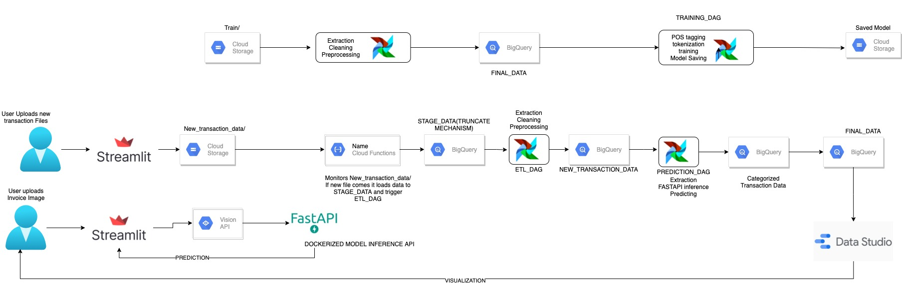
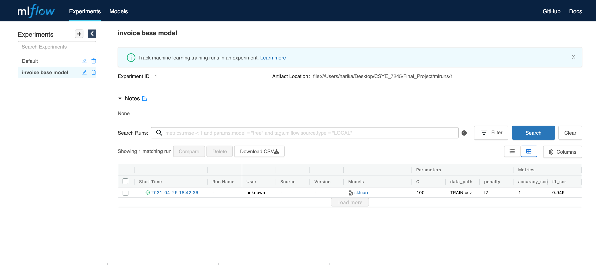
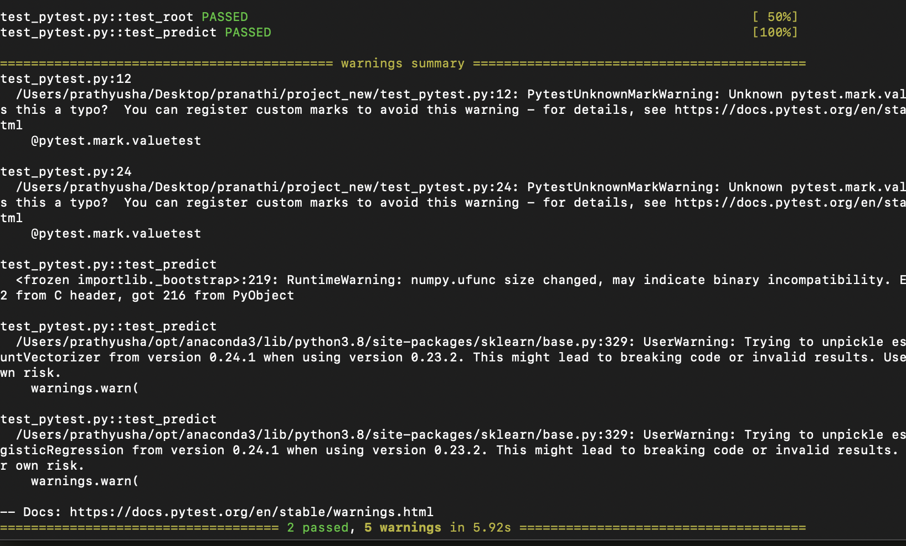

# Invoice Categorization

## Team 4 
Prudhvi Chandra Sekharamahanti 
Harika Reddy Gurram 
Pranathi Manusanipalli 

**Quick Links**
[Project Proposal](https://codelabs-preview.appspot.com/?file_id=1nvAtSC_nDl4NXlOl7yEZyio5rzNPpYlNWLXtEISqmS4#0)
[Project Presentation](https://codelabs-preview.appspot.com/?file_id=1uJjYrvPsVZbaoJAwq59MD0GCj4ow-jY00OaOuAx7HW4#0)

**Images on DockerHub.com**
[fastapi-project](https://hub.docker.com/r/prudh/project)

**WebApp**
[Streamlit App](https://streamlit-invoice-categorization-ii5x4gm7ra-uc.a.run.app/)

**Problem Statement:**  
Organization xyz is spending millions of dollars on various resources/products required for the company to run smoothly but has no definitive analytics and categorization tool that helps them with all their spends. The input can be CSV or batch files.Our goal is to predict the category of the invoice based on invoice description.We build end to end pipelines that handle extraction,preprocessing, perform model training and model serving functionalities with ease.

**User:** 

FINANCIAL ANALYST  

**Functions:** 

Upload new invoice transaction files for categorization(Batch) 
Uploads an invoice image and gets the associated predictions( category ) from the Model Inference API  

**Technology Stack:** 

- Cloud Storage
- Cloud Run
- Cloud Functions
- Cloud Composer
- Big Query
- Google Datastudio
- Streamlit
- FastAPI
- Docker
- Apache Airflow
- Pytest

## Architecture  

## Setup & Deployments

**Create a GCP account and activate your account to get 300$ free credit** 
Steps:
1. Go to https://cloud.google.com/ and click on ‘TRY IT FREE‘. 
2. Now, it will ask you to login to your Gmail account and choose your country and accept the terms & conditions 
3. In the third step, you have to fill your details, like account type, Name, Address, credit card details, tax information, etc. If you have old Gmail account and all the information is already there it would take it and you might not have to fill all the details. 
4. After filling all the details click on “Start my free trial“. 
5. Now Google will setup your cloud account and in few seconds your Google Cloud Platform account will be ready.  

**Creation of project** 
- In the dropdown beside search bar click on it and then click new project and create one  

For detailed account creation with screenshots visit: https://www.storagetutorials.com/create-free-trial-google-cloud-platform/ 

**Enabling API's**
- In the search bar on the Search for API's and Services --> then click on Library --> Search for Cloud Functions, Cloud Run, Cloud Storage, Cloud Build, Cloud Composer, Bigquery and enable them  

## Deploying Airflow Pipelines on Cloud Composer 

- Search for composer in the search panel 
- Click on create 
- Give the following options: 
  -  name: <name of composer environment> 
  -  Location: us-central1 
  -  nodes:3 
  -  Zone: us-central1-c 
  -  Machine type: n1-standard-2 
  -  Image Version: composer-1.16.2-airflow-1.10.15 
  -  Pyhton version: 3 
 Just change only the above mentioned options and click on Create 
- Once Environment is created, click on it got to PYPI packages and add below packages and click update: 
   - scikit-learn 
   - sqlalchemy==1.3.18 
   - pandas_gbq 
   - fsspec 
   - gcsfs 
- Now environment is ready to upload airflow dags and trigger them.  

Adding Dags to Environment Bucket: 
- In the Composer Home Page under DAGs folder for the created environment click on the hyperlink and it will take you to the dags folder where the dags needs to be uploaded.
- Here in this case it is: https://console.cloud.google.com/storage/browser/us-central1-airflow-e35eb1a6-bucket/dags;tab=objects?project=bigdata-311523&prefix=&forceOnObjectsSortingFiltering=false  

Running Airflow Dags: 
- Here we have 4 designed for the project purpose 
  - ETL_TRAIN: DAG to do the ETL on initial training data 
  - ML_MODEL_TRAIN: DAG to fetch the training data, train the classification model and save the model in Cloud storage 
  - ETL_INFERENCE: DAG to do ETL on newly coming transactions aand stage them into tables 
  - MODEL_INFERENCE: DAG that takes the new transactions from stage and predects the categories for invoices by inferencing dockerized FastAPI model 
- Inorder to successfully run the pipelines following steps to be implemented: 
   Training: 
  - First upload the training_data.csv file in invoice_images/train_data data 
  - In composer homepage on GCP we have url to access Airflow, here it is: https://jf9eec1d3b656d340p-tp.appspot.com/admin/. 
  - click on TRAINING_ETL_DAG whhich does the ETL and automatically triggers ML_MODEL_TRAIN_DAG which trains and loads the model 
  - Thus we accomplished the initial task of traning 
  Inference: 
  - We no need to trigger any DAG's manually for inference/prediction on new transactions automatically which will be clearly discussed in used case section below  

## Deploying Dockerized FastAPI for serving the model  
- cd into FastAPI folder  
Setting up docker and linking them with google Containerized Repositories: 

- Dockerizing Application

    `docker build -t <imagename> .`
  
    `docker run -d -p 8000:8000 imagename`

***Deploying the app on Google Cloud Run:*** 

- Install Google Cloud SDK 
- Authenticate the SDK using 
  `gcloud auth login` 
- Authenicate docker to push images to Google Cloud Container Repositories 
  `gcloud auth configure-docker` 
- Create a tag for your image 
  `docker tag imagename us.gcr.io/project-id/imagename`  
- Push the docker image 
  `docker push us.gcr.io/project-id/imagename`  
- Now to go to Cloud run and create a service with following parameters:  
  - select the image from the container repository which we pushed 
  - Memory: min 4GB 
  - Create 
- Once Cloud Run service is created we will get the service url and our API is up and running 
- To access the API use `SERVICE URL/predict` 

## Deploying Streamlit APP on Google Cloud run 
- cd into Streamlit folder   
Setting up docker and linking them with google Containerized Repositories: 

- Dockerizing Application

    `docker build -t <imagename> .`
  
    `docker run -d -p 8501:8501 imagename`
    
- Create a tag for your image 
  `docker tag imagename us.gcr.io/project-id/imagename`  
- Push the docker image 
  `docker push us.gcr.io/project-id/imagename`  
- Now to go to Cloud run and create a service with following parameters:  
  - select the image from the container repository which we pushed 
  - Memory: min 4GB 
  - Create 
- Once Cloud Run service is created we will get the service url and our APP is up and running 
- To access the APP use `<SERVICE URL>` 
    
## Mlflow 
MLFLOW is a open source project for tracking ML End to End life cycle project management.
Here, we are utilizing the Mlflow Tracking component of the Mlflow to record and compare parameters, metrics and results.

### Setup
Install Mlflow using `pip install mlflow`

### Instructions to run 
Using the data files from data/ folder, we train and test our model.
Run the Mlflow notebook which has the below steps
- Create Mlflow tracking client
- Create experiment
- Create run
- Creating the auxiliary function that defines the evaluation metrics for the model
- Start the run as defined in the TRAINING function in our notebook
- Finally, Visualize the experiments by running the `mlflow ui` command. This starts the server on our local host http://127.0.0.1:5000 where we can view the results of the runs and model artifacts which are stored in our local as well.

In this example, we have used f1_score and accuracy_score of the model as evalutaion metrics

### Pytest
- Run the pytests defined in the 'test_pytest.py' file using the following commands

 `pytest -m valuetest -v `  
 

 

  

